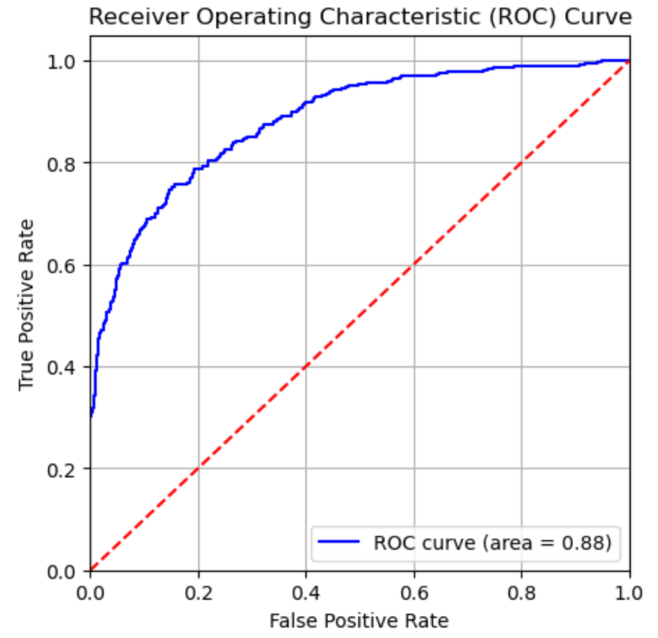
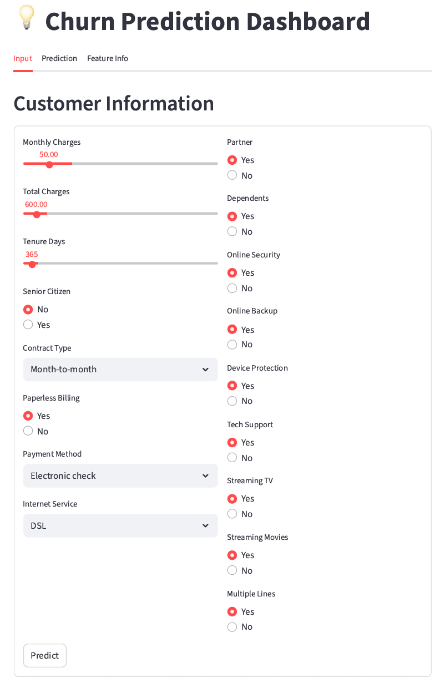
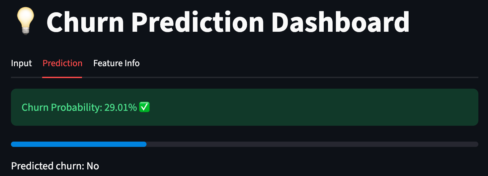

# Customer Churn Prediction for Telecom Operator Interconnect

## Introduction

In this project, we aim to predict customer churn for the telecom operator Interconnect using machine learning. The company wants to forecast which users are planning to leave and offer them promotional codes and special plan options. 

We start by preprocessing and integrating four datasets, preparing them for exploratory data analysis (EDA). Through feature engineering, we define the key input features and the target variable for a supervised binary classification task.
---

## Data Preprocessing & Feature Engineering

- Combined 4 raw datasets (contract, internet, personal, phone) using `customer_id`.  
- Handled missing values and categorical variables.  
- One-Hot Encoding (OHE) applied to categorical features.  
- StandardScaler applied to numerical features.  

---

To build the churn prediction model, we trained and evaluated several classification algorithms:

- Logistic Regression  
- Random Forest Classifier  
- LightGBM  
- XGBoost  
- CatBoost  

Model performance was evaluated using key metrics, including accuracy, ROC-AUC, and F1 score. Hyperparameter tuning aimed to achieve a ROC-AUC above 0.75. The best-performing classifier (XGBoost) was selected to reliably predict customer churn for Interconnect.

Finally, the selected model was used to build a web application using Streamlit and deployoed on Render, following principles of machine learning system design.

---

## Model Training and Evaluation

Models were trained using cross-validation and hyperparameter tuning (GridSearchCV). Performance metrics:

| Model                 | Dataset    | Accuracy | ROC-AUC | F1 Score |
|-----------------------|------------|---------|---------|----------|
| LogisticRegression    | Validation | 0.7360  | 0.8204  | 0.5903   |
| RandomForestClassifier| Validation | 0.7821  | 0.8482  | 0.6119   |
| LightGBMClassifier    | Validation | 0.8034  | 0.8797  | 0.6593   |
| XGBClassifier         | Validation | 0.8474  | 0.8724  | 0.6646   |
| CatboostClassifier    | Validation | 0.8417  | 0.8663  | 0.6443   |
| XGBClassifier         | Test       | 0.8488  | 0.8829  | 0.6816   |

**Best Model:** XGBoost with hyperparameter tuning (ROC-AUC: 0.8829).



---

## Deployment

The XGBoost model is deployed as a **Streamlit web application** on Render. Users can input customer features via an interactive form and receive churn probability in real-time.

## Folder Structure

```bash
churn-prediction-app/
│
├── app.py                      # Streamlit app for deployment
├── requirements.txt            # Python dependencies
├── README.md                   # Project documentation
│
├── notebooks/                  
│   └── churn_modeling.ipynb
│
├── data/                       
│   ├── contract.csv
│   ├── internet.csv
│   ├── personal.csv
│   └── phone.csv
│
├── artifacts/                  
│   ├── model_pipeline.joblib   
│   └── model_metadata.json     
│
├── images/                     
│   ├── roc_auc_xgboost.png     
│   ├── app_dashboard_1.png     
│   └── app_dashboard_2.png     
│
└── .gitignore                  
```





**Live App URL:** [https://churn-prediction-with-deployment-on.onrender.com]


